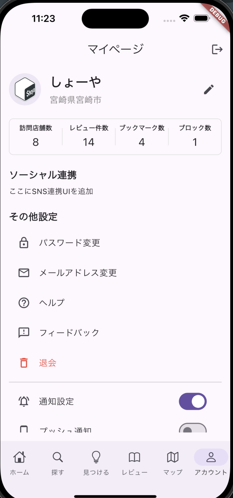

# ダミー画面設計書

このファイルは UI Spec Viewer の動作確認用です。

- 分割スニペット: `---` から `--50` が左、`--50` から `---` が右
- 複数ブロックの左右表示
- 比率指定（`--40` / `--50` など）

---

## 左側: マイページ画面

--50

## 右側: マイページ画面仕様

### 目的
プロフィール確認・編集、各種設定等へアクセスするための動線を確保する。

### 要素
1. ヘッダー
  a. ページタイトル（マイページ）
  b. ログアウトボタン
2. プロフィール
  a. 名前
  b. 住所
  c. 編集ボタン
3. ソーシャル連携
4. その他設定
  a. パスワード変更
  b. メールアドレス変更
  c. ヘルプ
  d. フィードバック
  e. 退会
  f. 通知設定
  g. プッシュ通知

| 項目 | 値 |
| --- | --- |
| 環境 | local |
| 版数 | 0.0.1 |

---

---

## 左側: ダッシュボード画面

--40

## 右側: ダッシュボード仕様

### 目的
ログイン後に主要KPIと最新情報を確認する。

### 要素
- KPIカード（売上、継続率、新規登録）
- 最近のアクティビティ一覧
- 通知エリア

### 操作
- KPIカードクリックで詳細ページへ遷移
- 一覧行クリックで詳細モーダルを表示
---

---

## 左側: エラー確認

--50

## 右側: エラー確認仕様

このセクションは意図的に存在しない画像を指定しています。
左側に画像が表示されることを想定していますが、パス不正で画像アイコンが表示されます。
---

## 通常Markdownセクション

このセクションは分割スニペット外の通常Markdownです。

1. 見出し
2. 箇条書き
3. テーブル

| 項目 | 値 |
| --- | --- |
| 環境 | local |
| 版数 | 0.0.1 |
